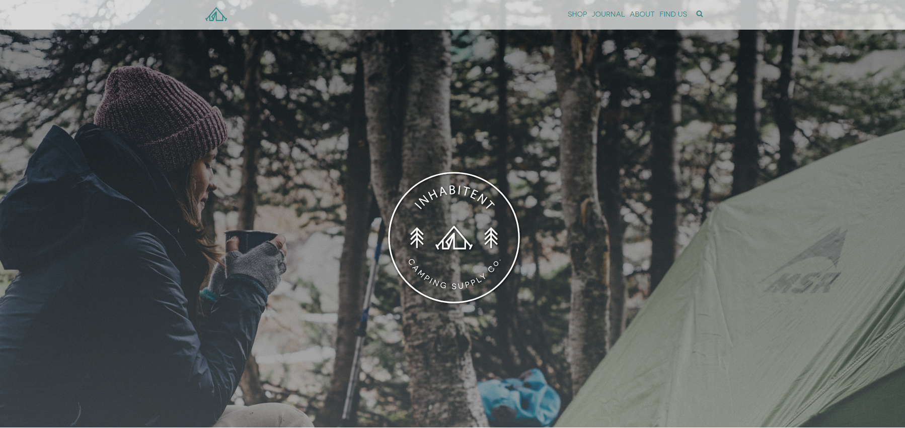

##About the Inhabitent Site

The Inhabitent site is meant to be a hipster-styled camping site, with a blog and products for sale

###Technology Used

  *WordPress 
  *Template Hierarchy
  *Custom Post Types
  *Custom Taxonomy Types
  *Using Template Parts
  *Plugin Building (we made a shop hours plugin)
  *Php (within wordpress)
  *VSCode
  *HTML5
  *SASS
  *GULP 
  *GIThub for version control.

###Building A Custom Theme with Wordpress.

We were given a Starter theme as a baseline to begin with for this project based off the Underscores framework. We spent 2 full weeks learning php and then using a combination of php, html, sass and a sprinkling of jquery to put together this multi page site. Although its not actually e-commerce functional, we were required to create a custom post type for the shop page to display all the products for "sale". Adding to that, we needed to create a custom taxonomy type to better sort the products in the shop. These new custom post and taxonomy types we created lead way into navigating the Wordpress Template Hierarchy, to properly create the template pages needed to display the user-generated information. The rest of the site was created using a mix of custom template pages, and creating smaller bite sized template parts to be reused in multiple pages. Using WordPress built-in functions we were able to dynamically generate content into the site for all of the pages/posts required. We used Php in an OOP functionality to create a small WordPress Plugin for the "client" to update their hours of operation. This project was basically a ton of SASS, as most of what we were required to do was style this multipage website. It was a challenge trying to best organize all the styles from the start, and I feel like things i did in the first few days made the process much more difficult down the line.

